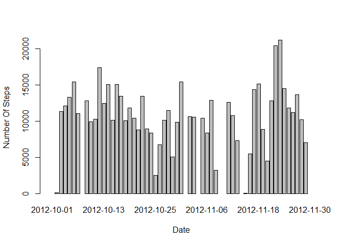
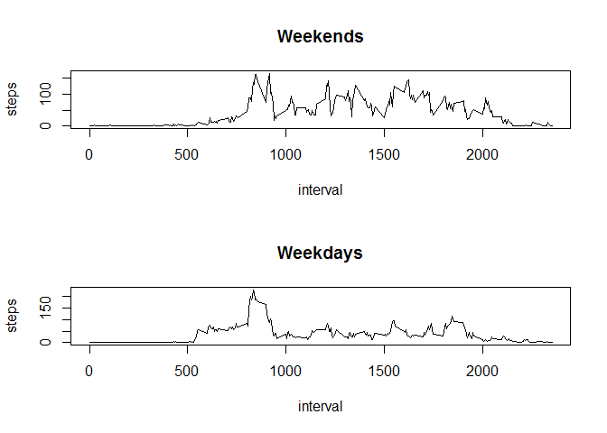

# Reproducible Research: Peer Assessment 1


## Loading and preprocessing the data

To download and load data, use download.file function, unzip and load id as data variable.


```r
temp <- tempfile()
download.file("https://d396qusza40orc.cloudfront.net/repdata%2Fdata%2Factivity.zip",temp)
unzip(temp, "activity.csv")
data <- read.csv("activity.csv")
unlink(temp)
```
Summary of loaded data


```r
summary(data)
```

```
##      steps                date          interval     
##  Min.   :  0.00   2012-10-01:  288   Min.   :   0.0  
##  1st Qu.:  0.00   2012-10-02:  288   1st Qu.: 588.8  
##  Median :  0.00   2012-10-03:  288   Median :1177.5  
##  Mean   : 37.38   2012-10-04:  288   Mean   :1177.5  
##  3rd Qu.: 12.00   2012-10-05:  288   3rd Qu.:1766.2  
##  Max.   :806.00   2012-10-06:  288   Max.   :2355.0  
##  NA's   :2304     (Other)   :15840
```

## What is mean total number of steps taken per day?

- Calculate the total number of steps taken per day

DPLYR library is used to calculate total number of steps per day

```r
library(dplyr)
```

```
## 
## Attaching package: 'dplyr'
## 
## The following objects are masked from 'package:stats':
## 
##     filter, lag
## 
## The following objects are masked from 'package:base':
## 
##     intersect, setdiff, setequal, union
```

```r
groupByDate <- data %>% group_by(date) %>% summarise(steps = sum(steps))
summary(groupByDate)
```

```
##          date        steps      
##  2012-10-01: 1   Min.   :   41  
##  2012-10-02: 1   1st Qu.: 8841  
##  2012-10-03: 1   Median :10765  
##  2012-10-04: 1   Mean   :10766  
##  2012-10-05: 1   3rd Qu.:13294  
##  2012-10-06: 1   Max.   :21194  
##  (Other)   :55   NA's   :8
```

- Make a histogram of the total number of steps taken each day

```r
barplot(groupByDate$steps, names.arg = groupByDate$date, xlab = "Date", ylab = "Number Of Steps")
```

 

The mean value is

```r
mean(groupByDate$steps, na.rm = TRUE)
```

```
## [1] 10766.19
```
The medain value is

```r
median(groupByDate$steps, na.rm = TRUE)
```

```
## [1] 10765
```


## What is the average daily activity pattern?

- Make a time series plot (i.e. type = "l") of the 5-minute interval (x-axis) and the average number of steps taken, averaged across all days (y-axis)


```r
groupByintervals <- data %>% group_by(interval) %>% summarise(steps = mean(steps, na.rm=TRUE))
plot(steps~interval,data=groupByintervals, type="l")
```

 

- Which 5-minute interval, on average across all the days in the dataset, contains the maximum number of steps?


```r
groupByintervals$interval[which.max(groupByintervals$steps)]
```

```
## [1] 835
```

## Imputing missing values
- Calculate and report the total number of missing values in the dataset (i.e. the total number of rows with NAs)

```r
sum(!complete.cases(data))
```

```
## [1] 2304
```
- Devise a strategy for filling in all of the missing values in the dataset. The strategy does not need to be sophisticated. For example, you could use the mean/median for that day, or the mean for that 5-minute interval, etc.

Mean for 5-minute intervals will be used for missing values.


```r
data <- merge(data, groupByintervals, by="interval", suffixes=c("",".y"))
naSteps <- is.na(data$steps)
data$steps[naSteps] <- data$steps.y[naSteps]
data <- data[ ,1:3]
```


## Are there differences in activity patterns between weekdays and weekends?
- Create a new factor variable in the dataset with two levels - "weekday" and "weekend" indicating whether a given date is a weekday or weekend day.

```r
isWeekend <- function(date) {
        day <- weekdays(as.Date(date))
        if(day %in% c("Saturday", "Sunday")) {
                TRUE
        }else {
                FALSE
        }
}
data$weekend <- as.factor(sapply(data$date, isWeekend))
```


- Make a panel plot containing a time series plot (i.e. type = "l") of the 5-minute interval (x-axis) and the average number of steps taken, averaged across all weekday days or weekend days (y-axis). See the README file in the GitHub repository to see an example of what this plot should look like using simulated data.

```r
par(mfrow=c(2,1))
for(weekOrNot in c(TRUE, FALSE)) {
    dataWeek<- aggregate(steps ~ interval,
                            data=data,
                            subset=data$weekend==weekOrNot,
                            FUN=mean)
    title <- "Weekdays"
    if(weekOrNot == TRUE) {
            title <- "Weekends"
    }
    plot(dataWeek, type="l", main=title)
}
```

 
